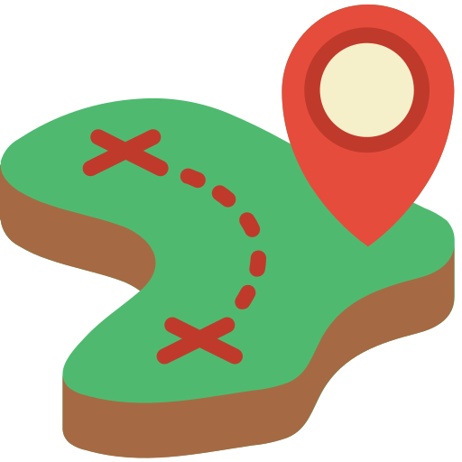

<!-- PROJECT LOGO -->
<br />
<p align="center">
  <a href="https://github.com/beannie-j/AStar-PathFinding">
    
  </a>

  <h3 align="center">Path Finding Visualiser</h3>

  <p>
  </p>
</p>

<!-- ABOUT THE PROJECT -->
## About The Project

This is a visualiser that implements the A* Path Finding algorithm. Let's find the shortest path to get somewhere!


Maze generation


Find path in a maze


Find path


### Built With

* [SFML library](https://www.sfml-dev.org/)


## Getting Started

To get a local copy up and running follow these simple steps.

### Prerequisites

`Path Finding Visualiser` is available for Windows. You should also have Visual Studio 2019 installed from [here](https://visualstudio.microsoft.com/downloads/)


### Installation

1. Clone the repo
```sh
git clone https://github.com/beannie-j/AStar-PathFinding.git
```
2. Run the GenerateProject.bat file. This should generate .sln file for you. Open the .sln file.
3. Build and run the project.


<!-- USAGE EXAMPLES 
## Usage

Use this space to show useful examples of how a project can be used. Additional screenshots, code examples and demos work well in this space. You may also link to more resources.
-->


<!-- ROADMAP 
## Roadmap

See the [open issues](https://github.com/beannie-j/AStar-PathFinding/issues) for a list of proposed features (and known issues).

-->

<!-- CONTRIBUTING 
## Contributing

Contributions are what make the open source community such an amazing place to be learn, inspire, and create. Any contributions you make are **greatly appreciated**.

1. Fork the Project
2. Create your Feature Branch (`git checkout -b feature/AmazingFeature`)
3. Commit your Changes (`git commit -m 'Add some AmazingFeature'`)
4. Push to the Branch (`git push origin feature/AmazingFeature`)
5. Open a Pull Request
-->


<!-- LICENSE -->
## License

Distributed under the MIT License. See `LICENSE` for more information.


<!-- CONTACT -->
## Contact

Jeannie An - [jeanniehjan@gmail.com](mailto:jeanniehjan@gmail.com) - email


